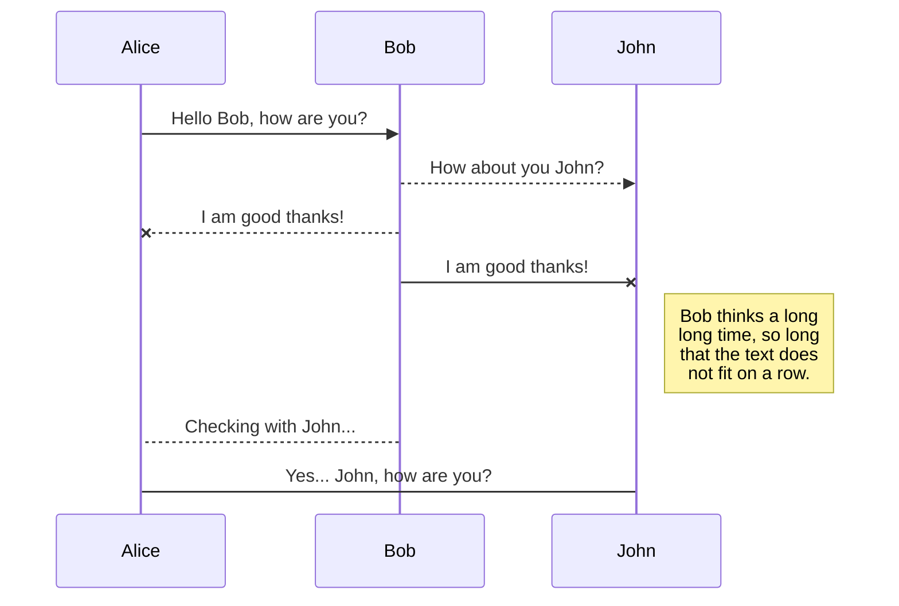
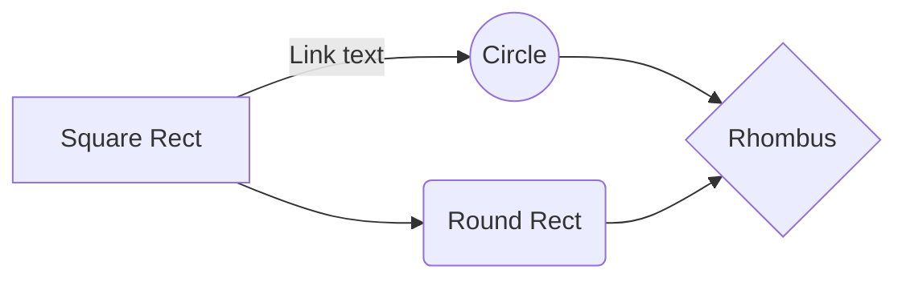

# Rki.CancerDataGenerator
Generator for German Clinical Cancer Data 

 

 

You can render UML diagrams using [Mermaid](https://mermaidjs.github.io/). For example, this will produce a sequence diagram:

And this will produce a flow chart:

