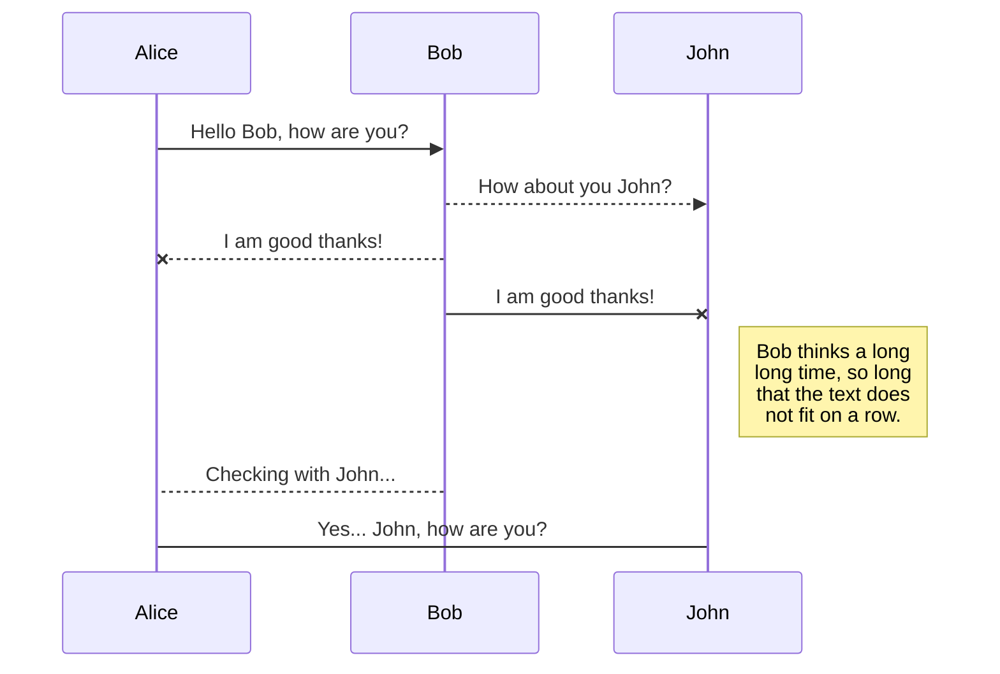
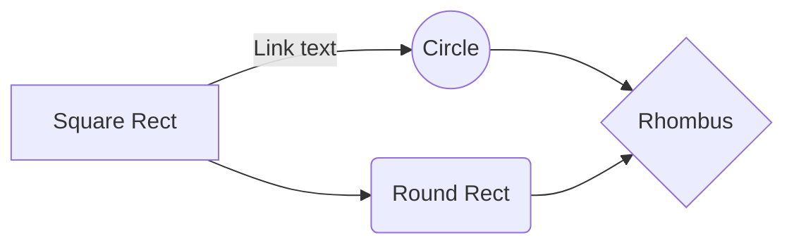

# Rki.CancerDataGenerator
Generator for German Clinical Cancer Data<br>
# Documentation
swagger.authentification.jwt.code analyzer

## packages

## startup

code:<br>    
  ```csharp
        /// <summary>
        /// get random enum
        /// </summary>
        /// <typeparam name="T"></typeparam>
        /// <returns></returns>
        public T FetchRandomEnumItem<T>(double missingProb = 0) where T : Enum
        {
            var list = fetchAllEnumItems<T>();
            var itemNone = fetchNoneEnumItem(list);
            // handle missingProb
            if (_random.NextDouble() < missingProb)
                return fetchNoneEnumItem(list);     // warning: if no item "none" is present, this will return enum[0]

            if (itemNone?.ToString() == "None")
                list.Remove(itemNone);
            return list[_random.Next(list.Count)];
        }

  ```

[](https://github.com/anuraghazra/github-readme-stats)
<br>
[](https://github.com/anuraghazra/github-readme-stats)
<br>


You can render UML diagrams using [Mermaid](https://mermaidjs.github.io/). For example, this will produce a sequence diagram:



And this will produce a flow chart:


