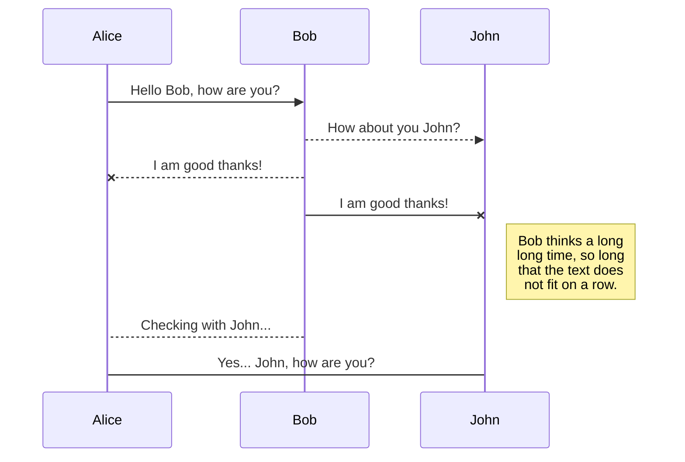
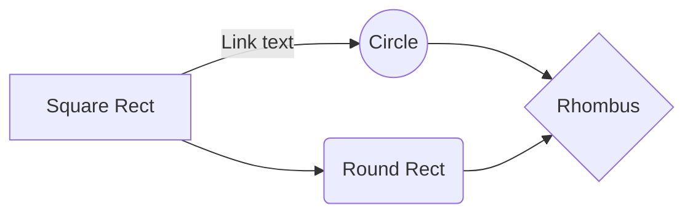

# Rki.CancerDataGenerator
Generator for German Clinical Cancer Data<br>
## Documentation
swagger.authentification.jwt.code analyzer

### packages
Required: (targetNET = 5.0)
```xml
  <ItemGroup>
    <PackageReference Include="JWT" Version="8.9.0" />
    <PackageReference Include="MathNet.Numerics" Version="4.15.0" />
    <PackageReference Include="Microsoft.AspNetCore.Authentication.JwtBearer" Version="5.0.13" />
    <PackageReference Include="Microsoft.AspNetCore.Mvc.Razor.RuntimeCompilation" Version="5.0.9" />
    <PackageReference Include="Microsoft.AspNetCore.Mvc.Versioning" Version="5.0.0" />
    <PackageReference Include="Microsoft.AspNetCore.Mvc.Versioning.ApiExplorer" Version="5.0.0" />
    <PackageReference Include="Microsoft.EntityFrameworkCore" Version="5.0.11" />
    <PackageReference Include="Microsoft.EntityFrameworkCore.InMemory" Version="5.0.11" />
    <PackageReference Include="Microsoft.EntityFrameworkCore.Proxies" Version="5.0.11" />
    <PackageReference Include="Microsoft.EntityFrameworkCore.SqlServer" Version="5.0.11" />
    <PackageReference Include="Microsoft.EntityFrameworkCore.Tools" Version="5.0.11">
    <PackageReference Include="Newtonsoft.Json" Version="13.0.1" />
    <PackageReference Include="Swashbuckle.AspNetCore" Version="6.2.3" />
  </ItemGroup>
 
  <PropertyGroup>
    <IncludeOpenAPIAnalyzers>true</IncludeOpenAPIAnalyzers>
  </PropertyGroup>
  
```
- note the `IncludeOpenAPIAnalyzers` element
- when inluded, VS will give advice on each build upon common misconceptions in api construction 

[API Versioning](#api-versioning)

### Configuring services
Startup.cs
```csharp
/* security */
            services.AddSingleton<IJwtAuthenticator, JwtAuthenticator>();   // add service as singleton
            services.AddAuthentication(options =>
                {
                    options.DefaultAuthenticateScheme = JwtBearerDefaults.AuthenticationScheme;
                    options.DefaultChallengeScheme = JwtBearerDefaults.AuthenticationScheme;
                })
                .AddJwtBearer(options =>
                {
                    //options.RequireHttpsMetadata = false;
                    //options.SaveToken = true;
                    options.TokenValidationParameters = new TokenValidationParameters
                    {
                        ValidateIssuerSigningKey = true,
                        IssuerSigningKey = new SymmetricSecurityKey(Encoding.UTF8.GetBytes(_config.GetValue<string>("JwtTokenPw"))),
                        ValidateAudience = false, 
                        // if ClockSkew is not nulled, 5min delay always apply!
                        ValidateLifetime = true, ClockSkew = TimeSpan.Zero,
                        ValidateIssuer = true, ValidIssuers = new string[] { "dexterDSD", "rki" }
                    };
                });
```
- Register own JwtAuthenticator as singleton service including Interface (ref)
- Add Authenticator service with jwt Options
- TokenValidationParameters define how jwt are processed
- IssuerSigningKey
    - can be symmetric or asymmetric
    - e.g. SHA256 means minimum 16 characters in secret must be provided
    - proposed: get secret from config files and load via ``GetValue`` from appsettings.json / local secret file

appsettings.json:
```csharp  
}
  },
  "JwtTokenPw": "my-secret-key",
  "AllowedHosts": "*"
}    
```
 - ValidateAudience / Issuer
  - provide values to check against - if Validation = true
  - LifeSpan: ClockSkew problem *must* be adressed to avoid minimum of 5min lifespan of jwt


### Configure swagger
#### API Versioning
Startup.cs
```csharp  
            /* Swagger */
            services.AddSwaggerGen(c =>
            {

                /* Versions */
                var v1 = new OpenApiInfo()
                {
                    Title = Globals.APPNAME,
                    Version = "v1",
                    License = new OpenApiLicense() { Name = "Testlicense", Url = new Uri("https://example.com/license") },
                    Contact = new OpenApiContact() { Name = "creator", Email = "me@exampl.com" },
                    Description = @"<h1>API</h1> <b>description</b> can be written using <strong>html</strong> tags.<br> <small>More to come.</small>",
                };
                var v2 = v1;
                v2.Version = "v2";

                /* create versioned docs*/
                c.SwaggerDoc("v1", v1);
                c.SwaggerDoc("v2", v2);
                
                ...
            });
            
            services.AddApiVersioning(o =>
               {
                   o.ReportApiVersions = true;
                   o.AssumeDefaultVersionWhenUnspecified = true;
                   o.DefaultApiVersion = new ApiVersion(1, 0);
               });
            services.AddVersionedApiExplorer(o =>
            {
                o.GroupNameFormat = "'v'VVV";
                o.SubstituteApiVersionInUrl = true;
            });
```
 - create a version template for recurring use (title, description)
 - each version gets inc number (format can be v1.5 too) and a version doc that can be selected in dropdown
 - API Versioniong must be enabled to have easy version access in controllers
   - assume version 1 when unspecified to avoid error
   - report api version to have clearer response in http header (ref)
   - set api pattern and allow substitution in URL
   - now this can be weaved into routing templates of controller

PublicController.cs
```csharp  
[ApiController]
    [Route(Globals.ROUTESTRING)]
    public class PublicController : ControllerBase
    {
    
    ...
    
    public const string ROUTESTRING = "/api/v{version:apiVersion}/[controller]";
```
#### Configure swagger authentification
Startup.cs
```csharp  
                /* Authentification JUST SWagger */
                c.AddSecurityDefinition("Bearer", new OpenApiSecurityScheme
                {
                    Description = "Insert the received JWT token into field, no leading 'Bearer' keyword.<br> It is valid for 2hrs.",
                    In = ParameterLocation.Header,
                    Type = SecuritySchemeType.Http,
                    BearerFormat = "JWT",
                    Scheme = "Bearer"
                });

                c.AddSecurityRequirement(new OpenApiSecurityRequirement()
                {
                    {
                        new OpenApiSecurityScheme
                        {
                            Reference = new OpenApiReference
                            {
                                Type = ReferenceType.SecurityScheme,
                                Id = "Bearer"
                            },
                        },
                        new List<string>()
                    }
                });
```
 - security definition is set to bearer behaviour
   - give description to user
   - get parameter from header, not query (question: cookies?)
   - schmeme must be set to http, contrary to apiKey
 - security definition must match security definition
   - with this setting, the "bearer" prefix must not be typed by the user
   
authenticate button in swagger


#### Configure autodoc
Startup.cs
```csharp  
// Set the comments path for the Swagger JSON and UI.
// Also note checking xml doc generation in build options
var xmlFile = $"{Assembly.GetExecutingAssembly().GetName().Name}.xml";
var xmlPath = Path.Combine(AppContext.BaseDirectory, xmlFile);
c.IncludeXmlComments(xmlPath);
```
 - this enables the generation of xml doc out of the inline code comments prefixed by /// 
 - document is found in assembly output folder


[](https://github.com/anuraghazra/github-readme-stats)
<br>
[](https://github.com/anuraghazra/github-readme-stats)
<br>


You can render UML diagrams using [Mermaid](https://mermaidjs.github.io/). For example, this will produce a sequence diagram:



And this will produce a flow chart:


